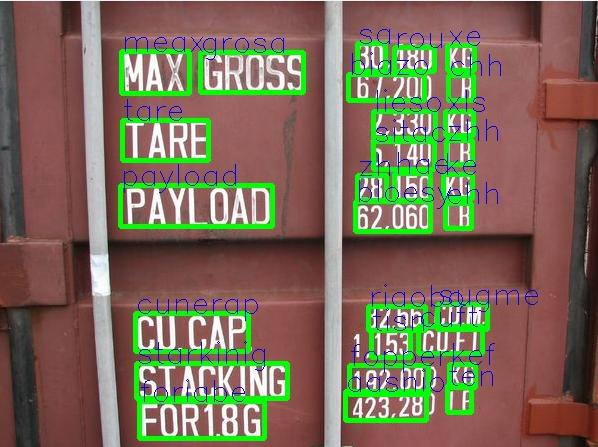

# 简介
  
# 目录结构
# 如何开始？
# 如何参与？

## 1. 论文要解决的问题是什么，该问题为什么重要？

> 目前OCR领域主要集中在约束场景下手工设计图像特征。（约束意味着在推理过程中存在一个固定的词典或词典，单词长度已知。）论文要解决的是无约束场景文本识别任务。这一任务存在很多问题未解决，主要原因有三：一是场景文本的多样性，即文本在不可控的环境中可拥有完全不同的字体、颜色、尺度和方向等；二是背景的复杂性，即自然场景图像中的背景通常是复杂的，且存在大量和真实文本十分相似的物体，因此容易导致混淆和错误；三是其他外界因素的干扰，如：扭曲、部分遮挡、光照不均等。

## 2. 以前解决该问题有哪些方法，有何不足之处？

> 超越约束条件的最新进步是由Jaderberg等人最近提出的方法，其中构建了两套CNN——一套用来建模字符序列，另一套用于N元语法的语言统计，然后用CRF图形模型结合起来。这种方法非常成功，设定了OCR领域的新标准。但是，它也存在一些问题，例如，使用两个不同的CNN会造成内存和计算成本相对较大。此外，手动定义的N-gram[1]CNN模型有大量的输出节点（N = 4，输出单位为10K），这增加了训练的复杂性——需要增量训练程序和基于N-gram的频率进行启发式梯度调整。

## 3. 论文提出了什么解决方案，效果如何？

> 论文提出了一个新的无词典的OCR框架，结合递归CNN进行图像编码，RNN进行语言建模，基于注意力的机制可更好的使用图像特征。这里开发的是一个注意力建模的递归循环神经网络（R2AM）系统，直接处理图像进行序列（字串）的学习，对Jaderberg的工作提供改进。文中描述了该项工作的三大成就：一是共享权重的递归CNN，比普通CNN在同样参数条件下图像特征提取能力更强；二是循环神经网络（RNNs）根据从上述递归神经网络提取的特征，进行字符级别语言模型的内隐学习。RNN可以自动学习字符的顺序动态，这自然存在于训练数据的字串中，不需要从字典中手动定义N-gram。三是一种顺序的基于注意力的建模机制，在读取字符序列时，进行“软的”确定性图像特征提取，并且在标准反向传播中可以训练成端到端的。

## 4. 论文作者下一步的工作方向是什么？

> 下一步将研究递归完全卷积网络，从而将输入图像中提取的图像特征和相应位置更好的结合在一起，并在输入域中视觉化注意力系数。另外，将采用门控单元，以便允许输入信号改变基于注意力的机制的状态，并且引入深度监督。
